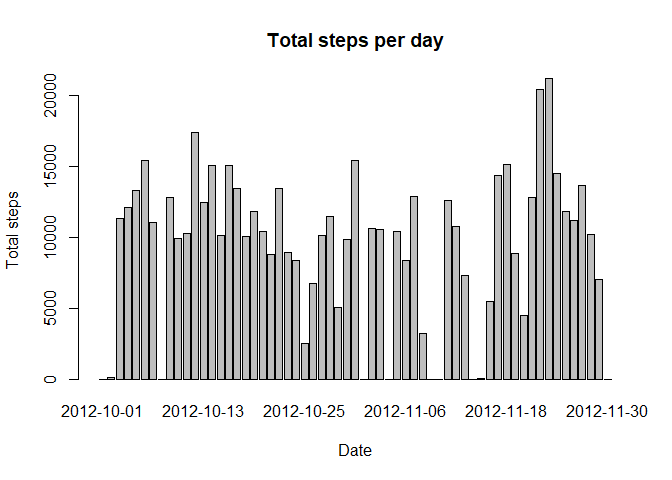
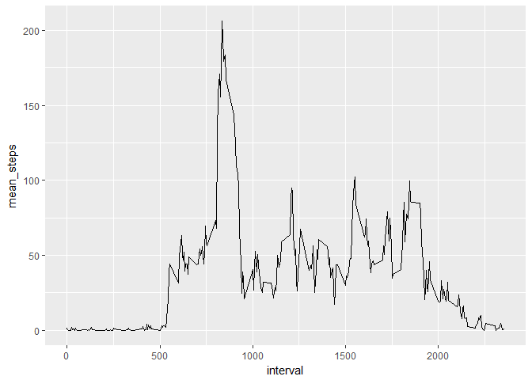
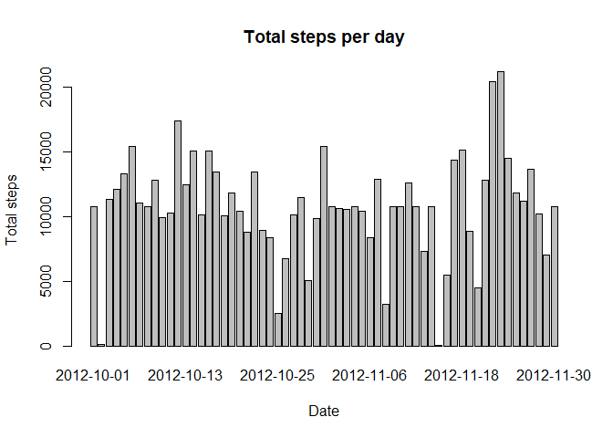
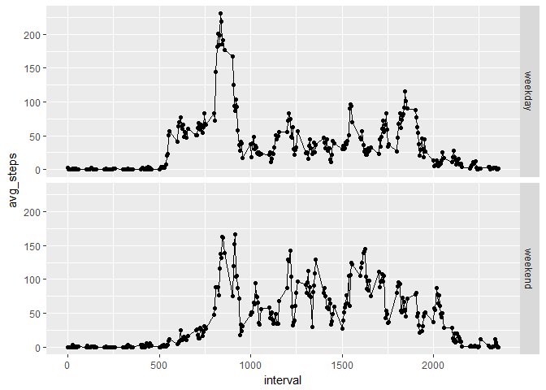

## Loading and preprocessing the data

```r
library(dplyr)
```

```
## 
## Attaching package: 'dplyr'
```

```
## The following objects are masked from 'package:stats':
## 
##     filter, lag
```

```
## The following objects are masked from 'package:base':
## 
##     intersect, setdiff, setequal, union
```

```r
library(ggplot2)
setwd("~/Coursera/RepData_PeerAssessment1")
unzip("activity.zip", exdir = "data")
data <- read.csv("data/activity.csv")
data$date <- (as.character(data$date))
```


## What is mean total number of steps taken per day?

```r
total_steps <- data %>% group_by(date) %>% summarise(total_per_day = sum(steps, na.rm=TRUE))
barplot(total_steps$total_per_day, names.arg = total_steps$date, xlab = "Date", ylab="Total steps", main="Total steps per day")
```

<!-- -->

```r
mean_steps <- mean(total_steps$total_per_day, na.rm = TRUE)
median_steps <- median(total_steps$total_per_day, na.rm = TRUE)
```
Median of total steps per day is 10395 and mean of total steps per day is 9354.2295082.

## What is the average daily activity pattern?

```r
interval_steps <- data %>% group_by(interval) %>% summarise(mean_steps = mean(steps, na.rm=TRUE))
plot <- ggplot(interval_steps, aes(interval, mean_steps)) + geom_line()
print(plot)
```

<!-- -->

```r
peak_interval <- which.max(interval_steps$interval)
```
The 288-th interval has the highest average number of steps.

## Imputing missing values

```r
missing <- sum(is.na(data))
joined <- left_join(data, interval_steps, by="interval")
for(i in seq_along(joined$steps)){
        if(is.na(joined$steps[i])){
                joined$steps[i] <- joined$mean_steps[i]
        }
}
total_steps2 <- joined %>% group_by(date) %>% summarise(total_per_day = sum(steps, na.rm=TRUE))
barplot(total_steps2$total_per_day, names.arg = total_steps$date, xlab = "Date", ylab="Total steps", main="Total steps per day")
```

<!-- -->

```r
mean_steps2 <- mean(total_steps2$total_per_day, na.rm = TRUE)
median_steps2 <- median(total_steps2$total_per_day, na.rm = TRUE)
```
Median of total steps per day is 1.0766189\times 10^{4} and mean of total steps per day is 1.0766189\times 10^{4}.

## Are there differences in activity patterns between weekdays and weekends?

```r
joined$date <- as.Date(joined$date)
Sys.setlocale("LC_ALL","English") 
```

```
## [1] "LC_COLLATE=English_United States.1252;LC_CTYPE=English_United States.1252;LC_MONETARY=English_United States.1252;LC_NUMERIC=C;LC_TIME=English_United States.1252"
```

```r
joined$wdays <- as.factor(weekdays(joined$date))
for(i in seq_along(joined$wdays)){
        if(joined$wdays[i] == "Saturday" | joined$wdays[i] == "Sunday" ){
                joined$wdays2[i] <- "weekend"
        }
        else{
                joined$wdays2[i] <- "weekday"
        }
}

wdays_average <- joined %>% group_by(wdays2, interval) %>% summarize(avg_steps = mean(steps)) 
wdays_average$wdays2 <- as.factor(wdays_average$wdays2)
plot2 <- qplot(interval, avg_steps, data=wdays_average, facets = wdays2~.) + geom_line()
print(plot2)
```

<!-- -->
